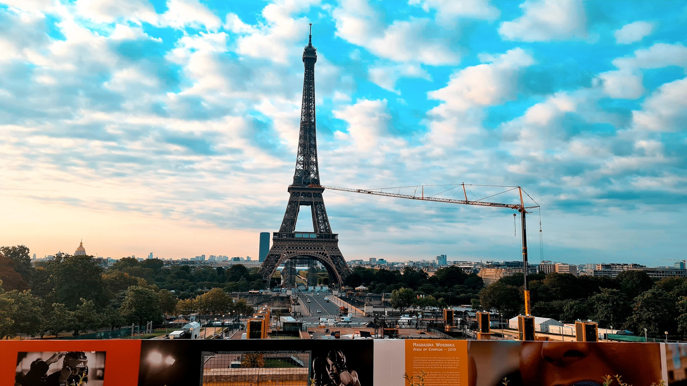
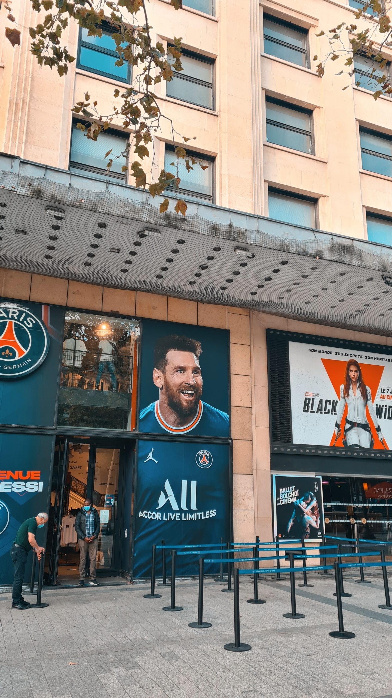

⚽️ FC Red Star Saint-Ouen – US Boulogne 1:3
🏆 League National
🏟 Stade Dominique Duvauchelle
🥁 ca 1.000 Zuschauer

Die Champions League Partie zwischen dem FC Valencia und dem FC Chelsea im Dezember 2019 sollte durch die Pandemie für 1 1/2 Jahre erstmal die letzte internationale Groundhopping Erfahrung bleiben. Zwei Tage in Paris bieten nun die Chance für das Reißen dieser Serie.

Zur Nachahmung empfohlen: Ein Lauf durch die Stadt am frühen Morgen. Die Seine, die Champs-Élysées, den Arc de Triomphe & der Eifelturm. All das hat man gefühlt für sich alleine, bevor so langsam die Stadt erwacht und sich kurz darauf in der Menge von Menschen baded. Dabei omnipräsent: Der Konterfei von Lionel Messi. Keine 48 Stunden nach dem Wechsel von Barcelona zu PSG grinst einem der mehrmalige Weltfußballer von sämtlichen Plakaten entgegen.

Frankreich fährt zu dieser Zeit einen harten Corona-Kurs. Der Eintritt ins Stade Dominique Duvauchelle ist nur mit einem Test möglich. Drinnen sind dann alle wieder ganz entspannt. Die Heimmannschaft führt bereits nach 2 Minuten, gerät aber noch vor der Pause in 1:2 Rückstand und kassiert in der zweiten Hälfte den dritten Treffer. In der Kurve scheint das niemanden zu groß zu stören. Freitagabend, Sonnenuntergang, Marihuana- und Biergeruch in der Nase. Das bedinungslose Anfeuern und die gute Atmosphäre scheint nicht ausschließlich dem Team, sondern irgendwie auch sich selbst und der Hoffnung auf eine Rückkehr der Normalität gewidmet zu sein. 

    
    

