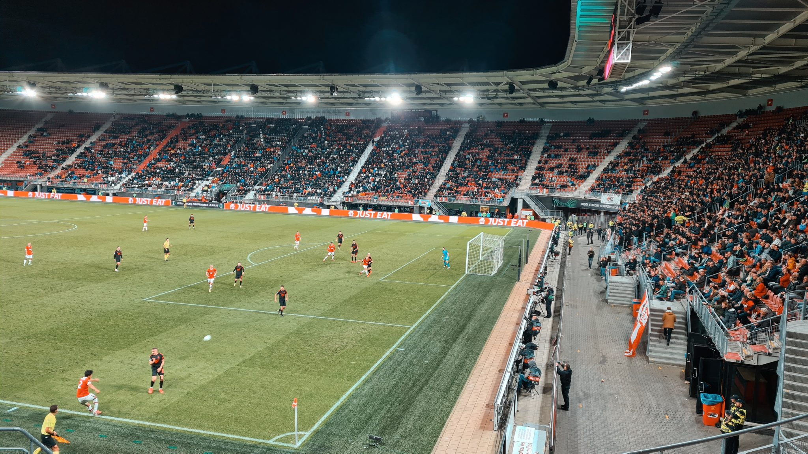

⚽️ AZ Alkmaar – FK Jablonec 1:0  
🏆 Conference League Vorrunde  
🏟 AFAS Stadium  
🥁 9.701 Zuschauer  

Max Kruse hatte kein Bock auf den Wettbewerb und schoss Union dann doch noch kurz vor knapp in die Conference League. Bei mir stand und steht die dritte europäische Liga auch nicht hoch im Kurs. Liegen lassen kann man ein Spiel dann aber doch irgendwie nicht, wenn im Moment es nur eine kurze Bahnfahrt entfernt ist. Nach 4 Tagen Konferenz in Amsterdam ist ein Spielchen eine Ablenkung zur richtigen Zeit.

Und für die kurze Begegnung mit kleinen Gruppe aus dem tchechischen Jablonec nad Nisou hat es sich schon gelohnt. Kurzes Foto + Dosenbier. Der viermalige Pokalsieger und zweimalige Meister hat es vor 40 Jahren mal bis ins Endspiel geschafft und 2009 den letzten großen Wurf unter Louis van Gaal mit der niederländischen Meisterschaft.

Das Spiel selbst ist schnell erzählt, Alkmaar ist spielbestimmend, schafft es aber nur zu einem Tor in der zweiten Hälfte zum ungefährdeten Sieg. 