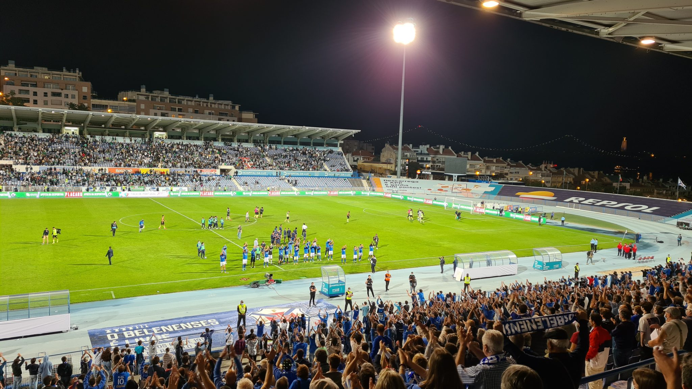
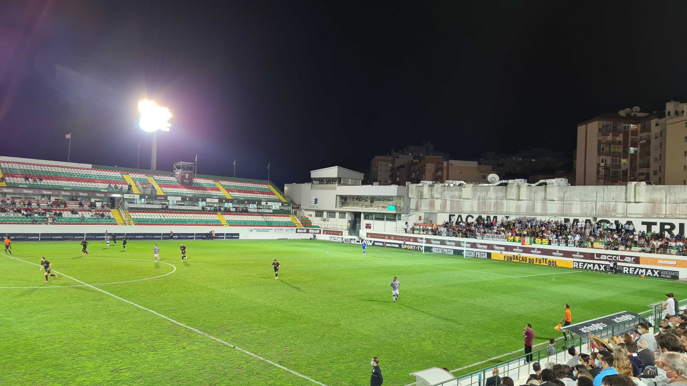

⚽️ CF OS Belenenses – Sporting Lissabon 0:4  
🏆 Taca Portugal  
🏟 Estádio do Restelo  
🥁 ca. 20.000 Zuschauer  

Die Weichen waren hier nach schnellem 0:1 direkt geklärt. Allerdings ist es dem Keeper von Belem zu verdanken, dass das Spiel auf dem Papier bis zur 68. Minute noch offen war. Wobei sich der Klassenunterschied ziemlich eindeutig dargestellt hat. Sporting lies nicht eine gefährliche Situation zu.

Traumhaft ist die Kulisse. Aus dem Stadion heraus hat man Sicht auf die Ponte 25 de Abril, die Lissabon & Almada über den Tajo verbindet. Gegenüber leuchtet Cristo Rei im Abendlicht.

Das Foto beweist, mit welcher positiven Energie die Fans ihre Mannschaft trotz deutlicher Niederlage gefeiert haben. Muito simpático. 

⚽️ CF Estrela da Amadora – Académico Viseu 4:0  
🏆 Segunda Liga  
🏟 Estádio José Gomes  
🥁 ca. 2000 Zuschauer  

Torfolge:  
1:0 Diogo Pinto (3.)  
2:0 Diogo Pinto (7.)  
3:0 Paulinho (9.)  
4:0 Diogo Pinto (12.)  

In der Vorstadt-Plattenbau-Idylle haben die Fans wie meist in Portugal die Angewohnheit erst knapp zum Anpfiff oder kurz nach Spielbeginn im Stadion zu sein. Das letzte Sagres vor dem Kiosk noch gemütlich zu Ende zu schlürfen, fällt einigen Stadionbesuchern heute jedoch vor die Füße. Der Liga-Neuling erlebt einen furiosen Start und hat nach 9 Minuten bereits dreimal eingenetzt. Und auch nach dem vierten Tor in der zwölften Minute füllt sich die Gegentribüne weiterhin stetig. „Olá, schon was passiert?“.

Während im Kopf schon die bisherige Stadion-Historie nach den meisten Toren durchsucht wird, fängt sich die Defensive der Gäste. Der Ehrentreffer war den 10 mitgereisten Auswärtsfans allerdings nicht mehr vergönnt. 

