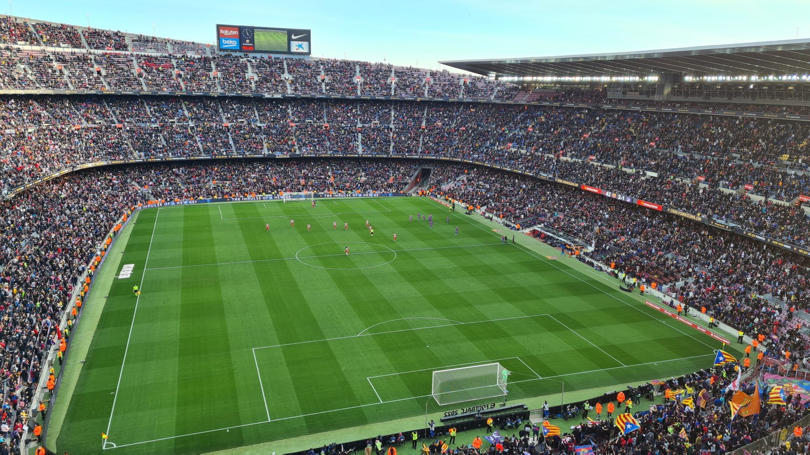

⚽️ FC Barcelona – Atletico Madrid 4:2  
🏆 Primera Divison  
🏟 Camp Nou  
🥁 74.221 Zuschauer  

Barca gegen Atletico, das ist im Februar 2021 ein bitterer Kampf um den vierten Platz in La Liga. Atletico bringt die Pace aus der vergangenen Saison nicht mehr auf die Straße und hat keine Chance auf die Titelverteidigung. Bei Barca sieht es bekanntermaßen v.a. finanziell ziemlich düster aus, die Zukunftsfähigkeit hängt an den Mehreinnahmen aus der Königsklasse.

Mein letztes Spiel hier liegt über 13 Jahre zurück. Damals ein 3:2 im Abendspiel gegen Real Betis – Doppelpack von Samuel Eto’o und Eidur Gugjohnson. Einzig verbliebener Spieler seit damals ist der mittlerweile 38 Jahre alte Dani Alves, der auch heute für Furore sorgt. Erst erzielt er das zwischenzeitliche 4:1, fliegt dann 20 Minuten später allerdings mit Glattrot runter und macht das Spiel beim 4:2 für die letzten 20 Minuten nochmal spannend.

Atletico führt früh durch Yannick Cassaro. Dieser wird direkt egalisiert durch ein wunderschönes Volleytor von Jordi Alba. Im Anschluss erspielt sich Barca eine Reihe von Chancen, aus denen in Summe drei weitere Tore resultieren.

Die Vibes sind heute ganz andere als noch vor einigen Jahren. Mittlerweile gibt es aber auch im Camp Nou seit einigen Jahren eine lebendige Kurve hinter dem Südtor, die es immer wieder schafft die 74.000 Zuschauer mitzunehmen. Die Atmosphäre ist wirklich richtig gut. Auswärtsfans sind nur gesprenkelt, aber nicht in großer Zahl dabei.