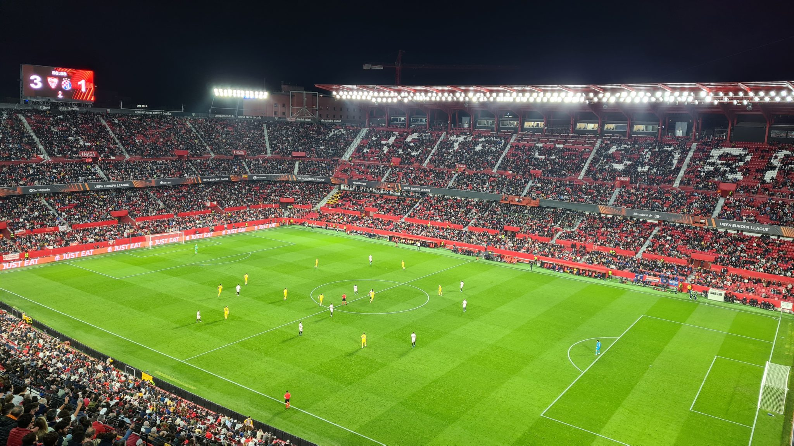

⚽️ FC Sevilla – Dynamo Zagreb 3:1  
🏆 Europa League Zwischenrunde  
🏟 Estadio Ramon Sanchez Pizjuan  
🥁 28.375 Zuschauer  

In spanischer Manier kommt man pünktlich zum Anpfiff ins Stadion. Früher ist es nach 45 Minuten Parkplatzssuche auch nicht möglich gewesen, die ersten Minuten hatte ich gedanklich schon abgehakt.

Der 6 malige Euro League Sieger übernimmt zügig die Kontrolle über das Spiel und zeigt vor allem in der ersten Halbzeit ansprechenden Kombinationsfußball auch innerhalb der Box. Am Ende sind es 612 vs. 316 Pässe. Man merkt schnell, dass Sevilla nicht ohne Grund in La Liga auf Platz 2 steht. Anthony Martial und Ivan Rakitic sind die offensiven Antreiber. Letzterer sorgt in der elften Minute für die frühe Führung. Zagreb kommt noch einmal glücklich zum Ausgleich, kassiert vor der Pause allerdings den Doppelschlag. In der zweiten Hälfte plätschert das Spiel etwas dahin, Sevilla muss sich den Vorwurf gefallen lassen hier den Sack nicht direkt zugemacht zu haben. Mit dem (überfälligen) Wegfall der Auswärtstor-Regel gibt es für Dynamo noch eine kleine Restchance im Rückspiel.

