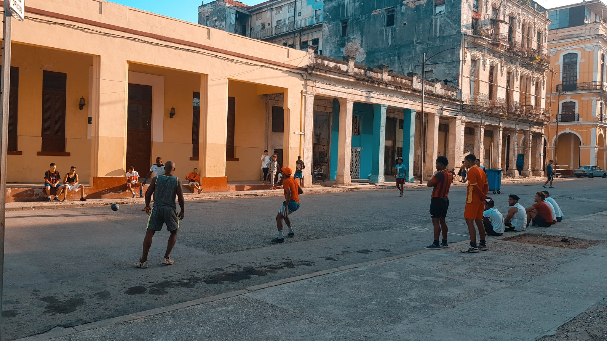

⚽️ Straßenkick in Kuba  
🏟 Havanna, Cayo Hueso  
🥁 ca. 20 Zuschauer  

Fußball fristet in Kuba bisher ein Nischendasein. Der Nationalsport ist Baseball, organisiert in einem mehrstufigen Ligensystem, wenn gleich alle Sportler Amateure sind. Die Fußball-Nationalmannschaft bringt es auf eine Teilnahme an der Weltmeisterschaft 1938 in Frankreich und scheidet seither in jedem Turnus früh in den Qualifikationsrunden aus. In Havanna sieht man aber immer wieder mal junge Männer und Kinder Trikots tragen, insbesondere aus der spanischen Liga.

Das Gespräch mit einem jungen Kubaner, vielleicht ein paar Jahre jünger, kam wegen seines Real Madrid Trikots schnell auf das am Tag stattgefundene El Classico. „Un gól de Marliano Diaz y un gól de Vinicius Junior. Real vuelve a estar en lo alto de la tabla.“, Real ist wieder Tabellenführer, teilt er mir stolz mit. Die Jungs dribbeln und ballern in beeindruckender Ballkontrolle und Geschwindigkeit zwischen zwei als Tor fungierenden Mülltonnen hin und her.

Einerseits habe ich mich über diese Begegnung und das kleine Spielchen in der Abendsonne sehr gefreut. Andererseits wird mir auch das extreme Ungleichgewicht in unseren Voraussetzungen und Möglichkeiten vor Augen geführt. Ich war erst drei Monate zuvor auf einer Reise in Spanien und dabei auch im Bernabéu Stadion, was ich mich hier gar nicht getraut habe zu erzählen. Eine richtige Aufstiegschance für die Einwohner Kubas gibt es nicht. Das sozialistische Land kann nur auf Einladung von außerhalb verlassen werden, den Wenigsten ist eine solche Chance vergönnt. Ob und für wen dieser Jungs sich im Leben einmal das Tor dazu öffnen wird, eine Reise zu machen und ihren Lieblingsverein im Stadion sehen zu können?

Auch wegen des rar gesäten Internets ist es schwer an Informationen zum regulären Spielbetrieb zu kommen. Wie es scheint, sind die vergangenen beiden Spielzeiten aufgrund der Corona Pandemie ausgefallen. Mittlerweile wird wieder gespielt. Wie in einigen südamerikanischen Ländern wird das Fußballjahr sowohl in einer abgeschlossenen Hin- sowie einer Rückrunde ausgespielt. Amtierender Sieger im Mai 2022 ist der FC Santiago de Cuba.

