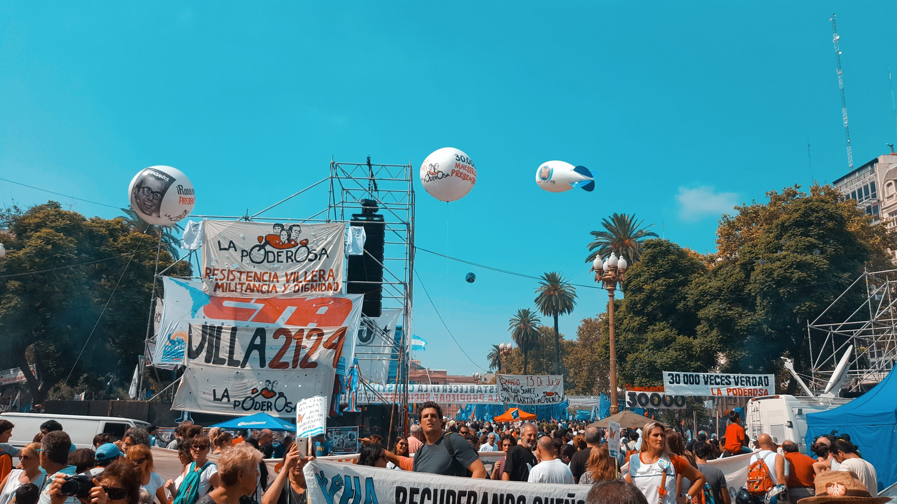
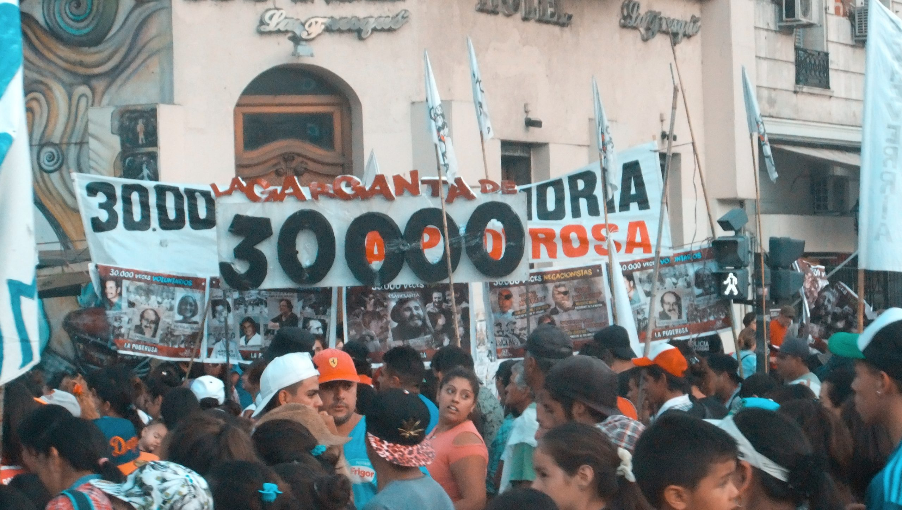
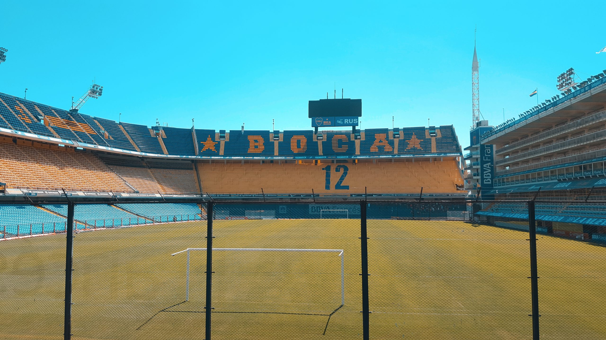

Es ist laut. Es ist stickig und es ist wahnsinnig heiß für einen Spätsommertag in Buenos Aires. Die Avenida de Mayo, die Straße welche direkt auf die Casa Rosada zuläuft, platzt aus allen Nähten an diesem Tag im März 2017. Die Casa Rosada, das ist der Palast des Präsidenten. Die Botschaft an ihn ist klar: Wir sind wütend, wir sind laut, wir sind viele. 500.000 Menschen sollen an diesem Tag in Buenos Aires auf die Straße gehen, über eine Millionen im Land.

Zwei Anlässe vermischen sich an diesem Tag. Es ist einerseits das jährliche Gedenken an das Ende der Militärdiktatur, die von 1976 bis 1983 andauerte. Andererseits klettert die Inflation im Land nach der Krise zu Beginn der 00er Jahre erstmals wieder in die Höhe und liegt 2017 bei 25 Prozent (!). Am 24. März 1976 putschte sich das Militär an die Macht. Es folgen sieben bittere Jahre für das Land. Die vermeintliche „Neuordnung“ des Landes wurde von der Regierung mit aller Gewalt durchgesetzt, Oppositionelle gefoltert und getötet. 30.000 Menschen sind in diesen sieben Jahren „verschwunden“ und nie wieder aufgetaucht.

    
    

Mitten in dieser dunklen Zeit hat auch die Weltmeisterschaft 1978 stattgefunden. Das gesamte Ausmaß der Diktatur ist erst nach deren Ende vollständig messbar geworden, zu dem Zeitpunkt des Turniers allerdings bereits nicht mehr zu leugnen. Fußball-Deutschland erlebte grade sein erfolgreichstes Jahrzehnt. Bayern München erringt dreimal hintereinander den Europapokal der Landesmeister, Borussia Mönchengladbach den Uefa Pokal. Der Panenka-Elfmeter von Belgrad 76 beendete die Serie von erfolgreich gestalteten Endspielen mit dem Europameistertitel 1972 und dem WM Triumph von 1974. Als Titelverteidiger kam eine Absage nicht wirklich in Betracht. Die Nationalelf nahm teil und schied in der Vorrunde aus. Argentinien als Gastgeber konnte sich zum ersten von bislang zwei Malen zum Weltmeister küren.

Der Modus der heimischen Premiere Division wurde in den vergangenen Jahres immer wieder verändert. Zur Saison 16/17 wird der Turnus nun analog zu den meisten europäischen Ligen von Sommer bis Sommer angepasst. Zu Beginn des Kalenderjahres 2017 allerdings führen Streitereien zwischen dem Verband und der Spielergewerkschaft zu einer Verzögerung nach der Winterpause, sodass erst ab Mitte März wieder gespielt wird.

**Und dann singen sie…**

… laut, euphorisch, melodisch, die ganzen 90 Minuten über. Die Lust ist spürbar groß nach für Argentinier viel zu langen 10 Wochen Pause. Und nach einem Tag wie diesem bildet man sich ein auch die Melancholie und Sehnsucht nach besseren Zeiten aus diesen Gesängen herauszuhören. Kein großes Vorprogramm unterbricht die Vorfreude auf das Spiel, zumal sich das Stadion sowieso erst kurz vor dem Anpfiff richtig füllt.

⚽️ River Plate – CA Belgrano 2:1  
🏆 Primera Division  
🏟 Estadio Monumental Antonio Vespucio Liberti  
🥁 ca. 70.000 Zuschauer  

Mit Beginn des Anpfiffs steht das komplette Stadion und wird sich auch bis zum Abpfiff nicht mehr hinsetzen. Dabei ist die Geschichte des Spiels selbst keine Besondere. River Plate ist dominierend, schafft dies in der ersten Hälfte allerdings noch nicht in eine Führung umzusetzen. Dann es gelingt kurz nach Wiederanpfiff Sebastián Driussi das ehrwürdige Rund zum Zittern zu bringen. Der etwas schmeichelhafte Ausgleich für die Gäste durch Christian Lema folgt nach etwa guten Stunde Spielzeit. Es dauert allerdings keine zehn Minuten bis Gonzalo Martínez die Heimmannschaft wieder in Führung bringt. Gleichzeitig stellt das auch das Endergebnis dar, was aber eher an der mangelhaften Torausbeue der Gastgeber, denn an einem ernsthaften Im-Spiel-Bleiben der Gäste aus Cordoba liegt.

**Seither**

Drei der fünf folgenden Meisterschaften gingen an den Erzfeind der Boca Juniors. 2021 war es dann soweit, nach sieben Jahren hat sich River Plate wieder zum argentinischen Meister gekrönt. Das Highlight war das Aufeinandertreffen beider Clubs im Finale der Copa Libertadores im Jahr 2018. Am Tag des Final-Rückspiels haben sich einige Anhänger allerdings selbst um DAS Highlight der letzten Jahre gebracht, das im Monumental stattfinden sollte. Das Hinspiel im Bombonera endete 2:2. Zum Rückspiel kommt es aber nicht, nach heftigen Auschreitungen und einem tätlichen Angriff auf den Boca Mannschaftsbus vor dem Spiel. Das Spiel wird zunächst verschoben und anschließend nach Madrid verlegt. Dort entscheidet River Plate die Südamerika Meisterschaft in der Nachspielzeit mit 3:1 für sich.

Die wirtschaftliche Situation Argentiniens hat sich in den letzten Jahren weiter zugespitzt, die Inflation ist stellenweise auf 50 Prozent geklettert. Ein Ausmaß, in welches man sich als in Deutschland Lebender nicht reinversetzen kann. Nach den Ausschreitungen im Rahmen des Endspiels sind 284 Stadionverbote gegen Mitglieder der Barras, der führenden Fangruppierung im Monumental, ausgesprochen worden, so wird es in der aktuellen Ausgabe der 11 Freunde berichtet.

Ein knappes Jahr später kam Corona dazu. Die Aneinanderreihung von Krisen, wie wir sie seit einigen Jahren auch in Europa erleben, das ist man in Ländern in Argentinien schon lange gewöhnt. Umso größer ist die Projektion der Sehnsucht nach guten Momenten auf dem grünen Rasen. Viele gute Gründe, noch einmal wiederzukommen.

    
    

