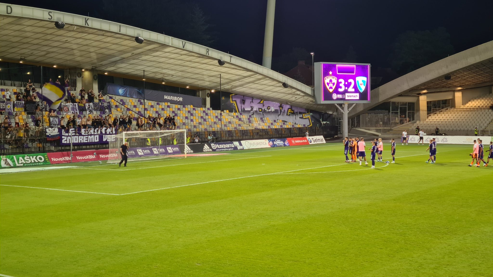

⚽️ NK Maribor – ND Gorica 3:2  
🏆 Slovenska Nogometna Liga  
🏟 Stadion Ljudski vrt  
🥁 ca 2.000 Zuschauer  

Maribor! Champion! So hallt es durch das Oval und trifft dabei auf entsprechendes Echo. Nicht wegen der euphorisierten Masse, sondern weil sich nur knapp 2000 Zuschauerinnen und Zuschauer zum ersten Heimspiel der neuen Spielzeit im 12.000 Besucher fassenden Stadion Ljudski vrt eingefunden haben. Maribor ist Rekordmeister und wieder Titelverteidiger in der slowenischen Liga, die mit der Unabhängigkeit 1991 zum ersten Mal ausgespielt wurde. 16 Meistertitel sind es seither. Trotzdem bietet die Liga in der Spitze an Abwechslung, vier Vereine konnten in den vergangenen fünf Jahren die Meisterschaft für sich entscheiden.

NK lässt dem Gegner in den ersten Minuten keine Luft zum Atmen. Der erste Abschluss gehört dann aber doch den Gästen und geht noch drüber. Zwei Minuten führt eine Flanke über rechts dann genau auf den Kopf von Etien Velikonja, der zum unerwarteten 0:1 einnickt. Eine einsame Bengalofackel erfüllt den mit handgezählten dreizehn Fans bestückten Auswärtsblock.

Zwischen der Führung und dem Ausgleich passt ein kurzer Gang zum Bierstand. Roko Bartunia stellt drei Minuten später wieder auf Gleichstand und sorgt damit zum ersten Mal für einen kurzen Moment guter Stimmung auf der Haupttribüne. Nach einer knappen halben Stunde kommt der Gast wieder mit zwei Verstößen zu guten Möglichkeiten aus der Distanz. In der Folge neutralisieren sich dann beide Mannschaften, doch mit dem Pausenpfiff fällt die Führung für NK durch Nino Zugelj.

Der Sitznachbar macht es vor, zwei frische Bier: Nicht dehydrieren! Gutes Argument. Nach der Pause geht es im Schlagabtausch weiter: Einen Konter über die linke Seite netzt I.Brnic ins rechte Eck zum 3:1 ein. Ein Eigentor stellt den Abstand kurz darauf wieder her. 3:2 ist auch das Endergebnis, die Spieler von Maribor sind in den Schlussminuten schon in den Köpfen beim Champions League Quali Rückspiel gegen Sheriff Tiraspol, was verloren gehen wird. 