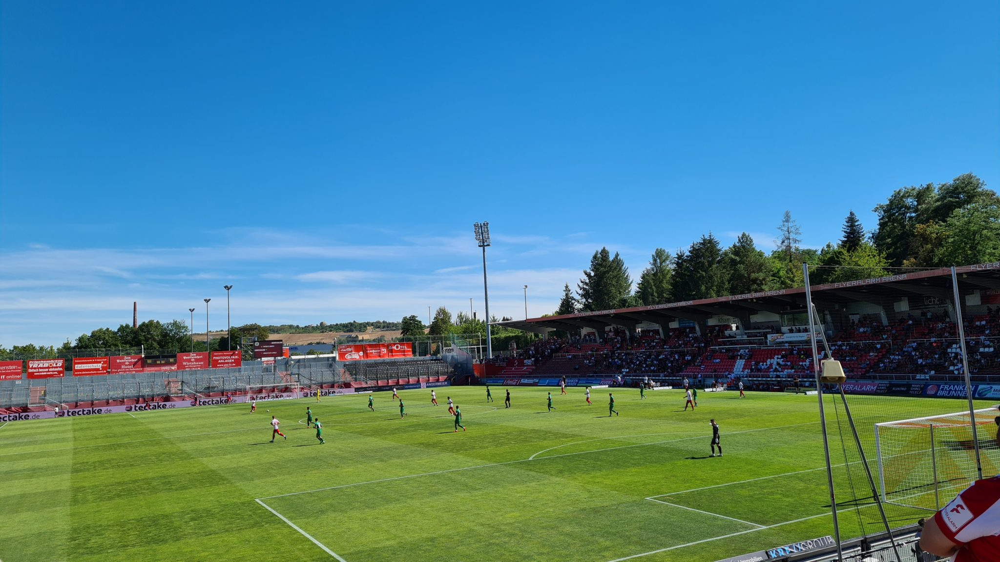

⚽️ Würburger Kickers – SpVgg Ansbach 7:1  
🏆 Regionalliga Bayern  
🏟 Stadion am Dallenberg  
🥁 2.243 Zuschauer  

Die Würzburger Kickers fallen in die Kategorie Vereine, die schon durch eine permanente Unstetigkeit in der Ligazugehörigkeit eine gewisse Anziehungskraft ausstrahlen. Paderborn-Bielefeld-Karlsruhe-Vibes. In den vergangenen elf Jahren sind die Kickers aus der Sechstklassigkeit bis in die zweite Liga geklettert. Nach dem direkten Wiederabstieg und drei Jahren in der dritten Liga gelang noch einmal der Aufstieg zur Corona Saison 20/21. In den letzen beiden Spielzeiten dann ging es je auf Platz 18 zweimal wieder runter bis in die Regionalliga Bayern, Amateurfußball.

*Die deutsche Meisterschaft ist uns egal,*  
*Wir scheißen auch auf den Pokal.*  
*Und zum Europacup würden wir nie geh’n,*  
*Wir steh’n auf Amateurfußball – Wollen die Kickers siegen sehen!*  

Sympathiepunkte gibt es für die Torhymne: House of Pain mit Jump around. Diese wird sieben Mal abgespult, so böse bekommt der Aufsteiger aus Ansbach auf die Mütze. Jump jump. Die Stimmung ist bei Schlusspfiff trotzdem auf beiden Seiten ausgelassen. Das dürfte auf Seiten der Gäste auch daran liegen, dass das Bier bei 38 Grad ohne Schatten auf der Gegengrade entsprechend gescheppert hat.

