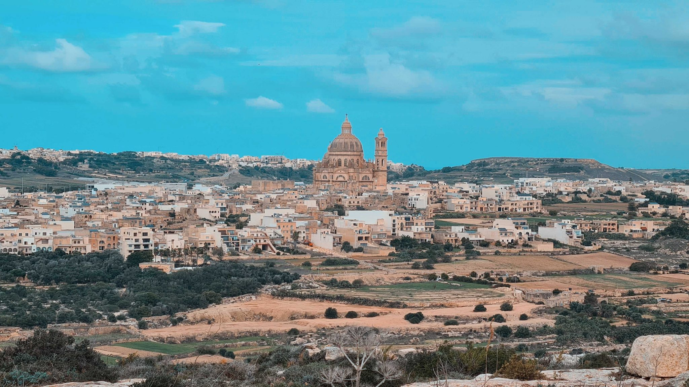
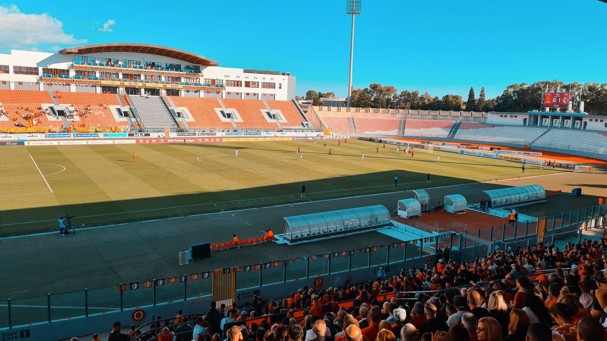
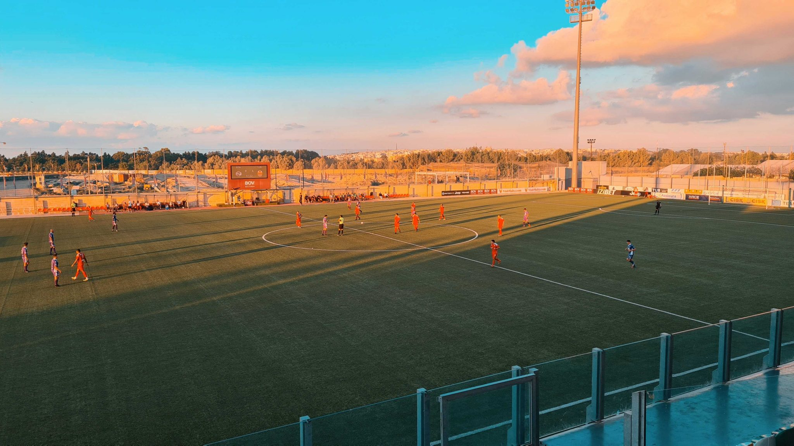
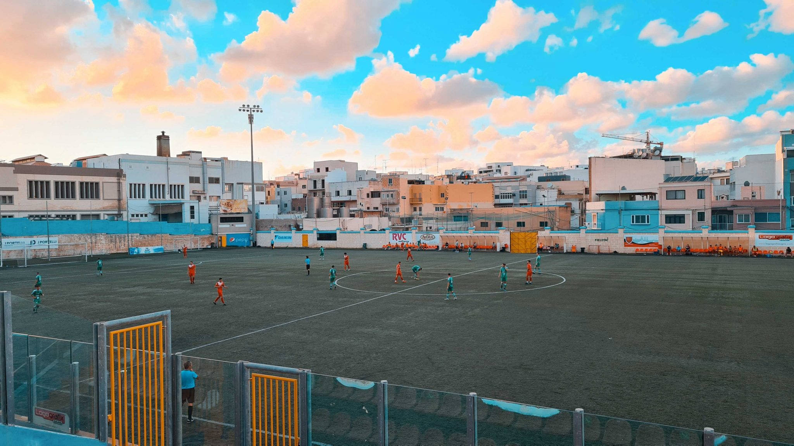
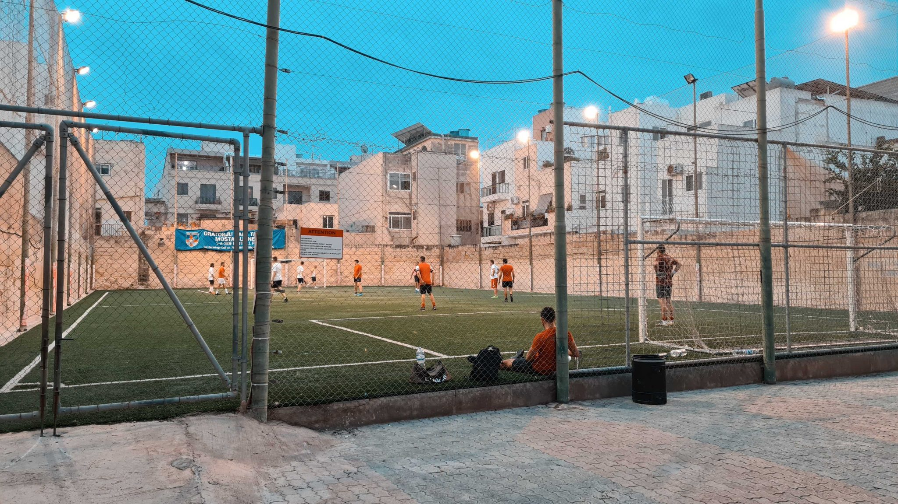
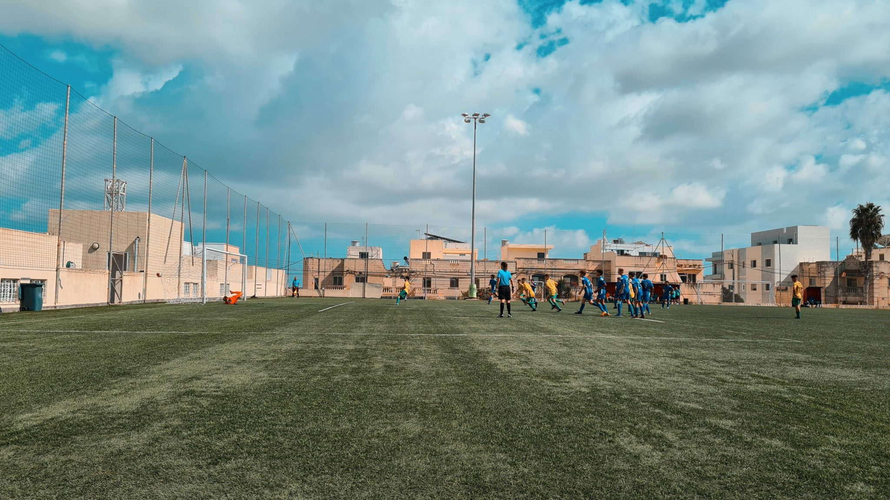
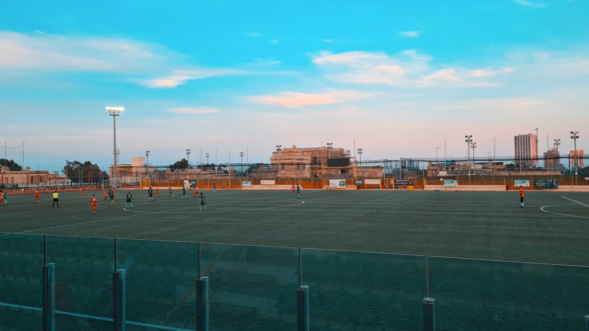
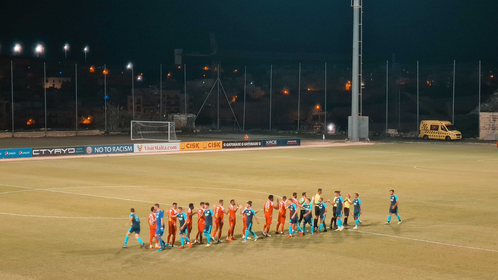

Malta, das ist Archipel- und Mittelmeer Feeling, Sonne satt, tolle Steilküsten und latentes Urlaubsfeeling. Malta, das sind aber auch zugebaute Städte rund um Valetta, Lärm, Stau, Schmutz, viel Leerstand und ein Busnetz das so funktioniert wie der Spielautomat in einer ruchigen Eckkneipe: Man kann mal Glück haben, grundsätzlich läuft das System allerdings gegen einen.

Fußball wird natürlich auch gespielt. Der malterische Fußballverband wurde wie der DFB im Jahr 1900 gegründet. Zwischen Gründung und erstem Spiel einer Nationalmannschaft lagen 57 lange Jahre. Sieben Jahre vor der Unabhängigkeit Maltas von Großbritannien im Jahr 1964 fand das erste Spiel gegen Österreich statt. Die Nationalelf des kleinen Inselstaates liegt zur Zeit auf Weltranglistenplatz 168, hinter Kuba und vor den Bermuda-Inseln. Die Meisterschaft hingegen wird schon seit 1909 nur mit Unterbrechungen im zweiten Weltkrieg sowie der Corona Pandemie ausgespielt. 

⚽️ Valletta FC – Hamrun Spartans FC 0:1  
🏆 Malta Premier League  
🏟 National Stadium Ta‘ Qali  
🥁 geschätzt 4.000 Zuschauer  

Das Nationalstadion Maltas steht in Ta‘ Qali, einem Gebiet mitten auf der Insel, der neben zweier Stadien und weiteren Sportanlagen auch mehrere Parks, Grünflächen und sogar eine Weinbaufläche beherbergt. Zur Zeit finden hier fast alle Spiele der ersten Liga statt, jeweils zwei am Samstag und Sonntag. Das führt dazu, dass sich während der zweiten Halbzeit des ersten Spiels bereits die Zuschauer der nächsten Partie auf der gegenüberliegenden Tribüne breit machen und Banner aufgehangen werden. Die Fans der Hamrum Spartans, Meister von 2021, machen ordentlich Radau. Mitten im Fanblock findet eine Blaskapelle Platz, die die Gesänge mit Trommeln, Saxophon und Trompete begleitet. Grund zum Feiern gibt es auch, denn das 0:1 durch Dodo (bürgerlich Ailton Jorge dos Santos Soares) in der 20. Minute wird nicht mehr hergegeben.

⚽️ St. Andrews FC – Lija Athletic 0:2  
🏆 Challenge League  
🏟 MFA Cenetary Stadium  
🥁 ca. 50 Zuschauer  

Den nächsten Groundpunkt kann man sich mit wenigen Metern verdienen, denn das Cenetary Stadium steht direkt nebenan. Der Kassierer Toni vergewissert sich nochmal ob wir uns im Stadion nicht geirrt hätten sondern das nächste Erstligaspiel gegenüber sehen möchten. Dann fragt er nach meiner Einschätzung der Performance seines FC Valletta, da er aufgrund seiner Tätigkeit hier das Spiel selbst nicht sehen konnte. Verdient verloren, sorry. Das Cenetary Stadium hat nur eine Tribüne, dafür aber neben dem Blick auf den Rasen auch auf die dahinterliegende Offroad-Rennstrecke, dessen Geschehen ehrlicherweise spannender ist als das stattfindende Fußballspiel. Das sehen wohl auch die weiteren Zuschauer so, die mehr auf ihr Handy denn auf das Spielfeld schauen. 

⚽️ Mqabba FC – Qrendi FC 2:0  
🏆 Challenge League  
🏟 Vicor Tedesco Stadium  
🥁 ca. 300 Zuschauer & ein Hund  

Im Victor Tedesco Stadium gibt es ein Wiedersehen mit der Blaskapelle. Dieses Mal muss die Besetzung allerdings eine andere sein, denn die Qualität liegt weit unterhalb der Performance aus dem Ta‘ Qali Stadion. Sweet Caroline, komplett schief und aus dem Takt.

Auf die Tribüne hat sich auch ein Zuschauer mit Hund verlaufen. Dieser verfolgt das Spiel deutlich intensiver als sein Herrchen, der die meiste Zeit am Handy daddelt. Die Aufmerksamkeit wird mit einem kurzweiligen Spiel belohnt. Nach zerfahrener Anfangsphase ballert der Gast den ersten Konter an die Latte. Qrendi wird mit der Zeit besser und markiert den nächsten Alu-Treffer. Das Tor macht dann die Heimmannschaft, bei der der Flügelflitzer auf rechts mit der Zeit für Furore sorgt. Beim Torjubel fliegt der aus Plastik zusammengebastelte Drumstick des Trommlers außeinander und einer Spielerfrau um die Ohren.

Nach dem 2:0 schwächt sich das Mqabba durch Gelb-Rot nach Ballwegschlagen noch einmal selbst. So bietet sich für den nicht ganz austrainierten Keeper nochmal die Möglichkeit zu Glänzen, als er zum wiederholten Male zum Hechtsprung für einen Ball ansetzt, den man auch mit zwei Schritten ohne Hinschmeißen locker hätte aufnehmen können.

⚽️ Kleinfeld Kick, Rot – Weiß
🏟 Hinterhof der Oratorju Kirche, Mosta
🥁 5 Zuschauer

Die Messe in der Rotunde von Mosta hatte bereits begonen, kein passender Zeitpunkt spontan hereinzuplatzen. Bis zur Möglichkeit wieder hereinzukommen führt ein kleiner Spaziergang in den Hinterhof der nahegelegenen Kirche Oratorju. Team Rot (Trikots von Arsenal & Inter (Ausweich)) spielt gegen Team Weiß, sechs gegen sechs. Highlight in der kurzen Zeit ist ein gekonntes Dribbling eines Spielers aus dem Team Weiß um zwei Gegener Herum mit gekonntem Lupfer ins Tor. 

⚽️ Zebugg Rangers U17 – Mellieha SC U17 3:1  
🏆 U17 League  
🏟 Dingli Swallows Football Ground  
🥁 ca. 30 Zuschauer  

Das Dorf Dingli ist Ausgangpunkt einer tollen Wanderung entlang der Steilküsten der Westseite Maltas. Wandert man immer weiter führt der Weg nach 1 1/2 Stunden zu den Ħaġar Qim, einer über 5000 Jahre alten Tempelanlage. Aber erstmal: Mittagsonne abwarten. Für 2.50€ Eintrittpreis gibt es eine kurzweilige Junioren Partie mit besserem Ende für die Zebugg Rangers zu sehen. 

⚽️ Kalkara United FC – Xghajra Tornados FC 1:0  
🏆 National Amateur League Group A  
🏟 Luxol Sports Ground  
🥁 ca. 200 Zuschauer  

Begegnung Nummer drei mit einer Blaskapelle. Die scheint aber spätestens hier etwas fehl am Platz, denn die müde Partie gibt wirklich wenig her. Parallel spielen an diesem Tag Dortmund und Liverpool, beides zu sehen in der Stadionkneipe. 

⚽️ Gudja United FC – Marsaxlokk FC 1:2  
🏆 Malta Premier League  
🏟 Tony Bezzina Stadium  
🥁 ca. 400 Zuschauer  

Die ersten Minuten dieser Partie verlaufen schleppend. Gudja kommt etwas besser ins Spiel und vergibt nach knappen zehn Minuten die erste Großchance. Nach einer halben Stunde bestimmen nur noch Pöbeleien und Schauspielerein das Geschehen. Viel Lärm, wenig Fußball und Action auf der Tribüne.

Die aufgeheizte Stimmung mündet in der Szene des Abends. Der Auswechseltorwart von Gudja bekommt auf der Bank die Rote Karte. Dieser entkleidet sich anschließend und wirft jedes Einzelteil wutendbrannt auf den Platz auf dem Weg in die Kabine, während ein Betreuer hinterhertrottet und die Teile aufsammelt. Aus der Kabine dringen nun laute Geräusche, hörbar geht etwas zu Bruch. Die Szene läuft ungeschnitten während der Keeper wieder aus der Kabine rausplatzt und eine Mülltonne samt Inhalt zerlegt. Das ganze Schauspiel erstreckt sich über gute drei Minuten und wird erst durch fünf (!) Polizisten beendet, die ihn anschließend aus dem Stadion hinausgeleiten.

Nach torloser erster Halbzeit gelingt dem Gast ein Doppelschlag auf welchen die Heimmannschaft nur noch mit einem Anschlusstor antworten kann.

