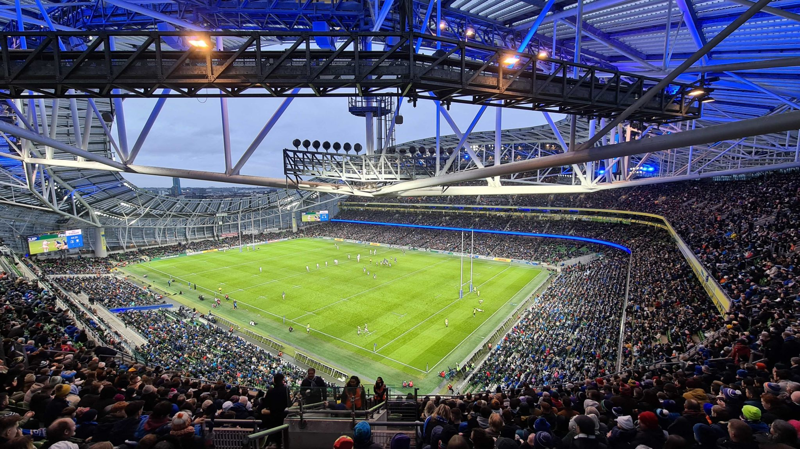
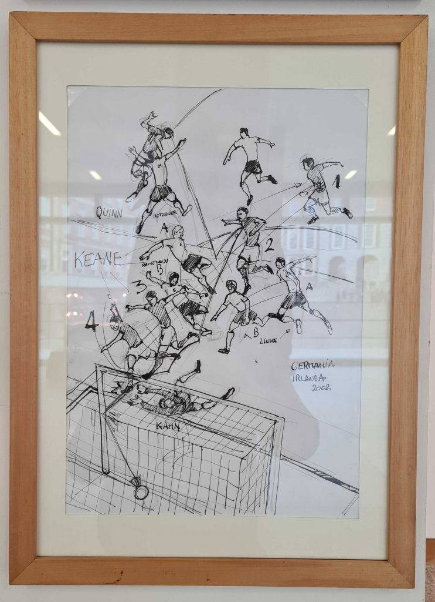

Irland im Januar. Das klingt erstmal ungemütlich nach kalten Regentagen. Der runde Geburtstag meines Lieblingsmenschen führt uns trotzdem für ein paar Tage auf die Insel. Und im Vergleich zu Hamburg stellt die Reise sogar ein Upgrade von acht Grad dar.

Fußball spielt auch in Irland eine Rolle, liegt in der Beliebtheit allerdings hinter Hurling und Gaelic Football, einer Variante, die Rugby und Fußball vereint und die in der Hauptstadt zehntausende Zuschauer in den Croke Park lockt. Die Spielzeiten beginnen allerdings erst später. Einzig Rugby wird bereits im neuen Jahr wieder gespielt. An diesem Tag ein Europapokalspiel zwischen Leinster, die Region rund um Dublin, und Racing, einem Verein aus der Nähe von Paris.

🏉 Leinster Rugby – Racing 92 36:10  
🏆 Heineken Champions Cup  
🏟 Stadium Aviva  
🥁 ca. 30.000 Zuschauer  

Als kompletter Laie muss erstmal das Basis-Regelwerk studiert werden. Hier geht es um Rugby Union, Fünfzehn gegen Fünfzehn. Fünf Punkte gibt es für einen Erfolgreichen Versuch, quasi das Touchdown-Analogon aus dem Football. Zwei weitere Punkte gibt es im Anschluss an einen erfolgreichen Versuch durch eine Erhöhung, der Kick zwischen das H-Tor aus Höhe des zuvor gestarteten Versuchs. Weitere Möglichkeiten Punkte zu erzielen ist ein Penalty Kick oder ein Dropgoal aus dem Spielheraus, ein Dropkick zwischen das H-Tor. Der Ball darf nur seitwärts oder nach hinten gepasst werden, die Bewegung nach vorne muss läuferisch oder per Kick erfolgen. Die Gegner werden jeweils per Tackling am Laufen gehindert, nach einem erfolgreichen Tackling (Spieler liegt am Boden) gibt der ballführende Spieler den Ball nach hinten ab, es sei denn, er wird erobert.  

Die Anfangsphase gehört der Heimmannschaft. Leinster macht immer wieder spielerisch Boden gut, die Gäste können sich zunächst nur durch Kicks nach vorne befreien. Folgerichtig ist die Führung durch O‘Brien in der 14. Minute. Nach jedem erfolgreichen Versuch versammeln sich die Spieler an der eigenen Grundlinie und bilden auf beiden Seiten einen Kreis. Zeit, sich zu organisieren.

Den Gästen aus Racing gelingt es vor der Pause das Spiel zu drehen. Mit zwei erfolgreichen Versuchen, allerdings je mit nicht verwerteter Erhöhung, schrauben sie das Ergebnis in der auf 7:10. Zwei Momente, in denen die geschätzten 100 mitgereisten Fans der Gäste sichtbar werden. Blau Weiße Fahnen schwenken auf der Südtribüne. Generell reagiert das Publikum fast ausschließlich spielbezogen. Je näher ein Spieler an der Grundlinie des Gegners und je länger ein Laufweg ohne Tackling auskommt, je lauter das Geraune durchs Rund.

In der 52. Minute geht Leinster dann wieder in Führung. Interessante Beobachtung ist die Videoreferee Entscheidung zum knappen 12:10. Die Szene wird für alle Stadionbesucher sichtbar auf der Stadionleinwand wiederholt. Hintergrund: Ein Versuch ist nur dann erfolgreich, wenn der Spieler im Moment der Bodenberührung die Kontrolle über den Ball hält. Der Schiedsrichter entscheidet basierend auf diesen Bildern Pro Heimmannschaft. Die Gäste brechen in der Folge ein und kassieren in der Folge eine Reihe von vier Versuchen. Am Ende steht es 36:10.

Pluspunkte sammelt das Spiel neben vielen ansehnlichen längeren Phasen mit flüssigen Läufen auch durch den Preis: 25 Euro für ein Europapokalspiel würden beim Fußball eine Rarität darstellen.

Ganz ohne Fußball muss der Besuch allerdings nicht auskommen. Im italienischen Institut für Kultur gibt es unter dem Titel Chasing Football eine temporäre Ausstellung, die sich insbesondere auf die Jahre 1990 bis 2002 und das Abschneidern der italienischen sowie irischen Mannschaft fokussiert. Die Schnittmenge beider Teams stellt neben dem zeitweisen Engagement von Giovanni Trapattoni als Nationaltrainer auch zwei Begegnungen bei Weltmeisterschaften dar. 1990 siegte Italien bei der Heim-WM in Rom mit 1:0. Vier Jahre später siegte Irland in New Jersey mit demselben Ergebnis.

Auch die Historie von Fußballstickern wird in der Ausstellung aufgegriffen, die bereits im Jahr 1895 (!) ihren Anfang nimmt. Der Italiener Gianni Bellini nennt die wohl größte Panini Sammlung der Welt sein eigen und hat für diese Ausstellung einige Alben als Exponate zur Verfügung gestellt. 

Nostalgischen Kindheits-Wiedererkennungswert hat eine Skizze des 1:1 Ausgleichstores Irlands gegen Deutschland in der Vorrunde der WM 2002. 90 plus zwei Minuten stehen auf der Uhr als die Abwehrreihe um Christoph Metzelder, Carsten Ramelow & Thomas Linke den wuchtigen Robbie Kean nicht am Treffer hindern können. Die anschließende Jubelszenerie wird jeder 2000er Youtube-Junkie auswendig können.

Der Tag wird abgerundet mit einem feuchtfröhlichen Abend in Oliver St. John Gorgaty’s Bar. Guinness & Folk. Irische Interpretationen diverser Rock Klassikern (Geige und verschiedene Flöten, schnelleres Tempo) von richtig guten Musikern. Und wirklich jeder im ganzen Pub tanzt, lacht, ist fröhlich und macht klar, warum diese Stadt mit ihrer Atmosphäre in Irish Pubs auf der ganzen Welt zum Sehnsuchtsort wird.

