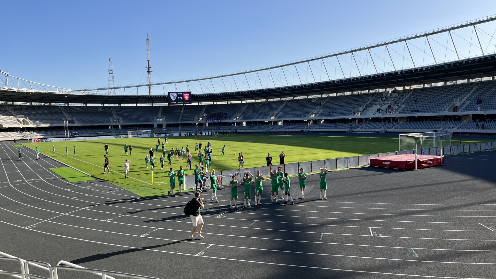
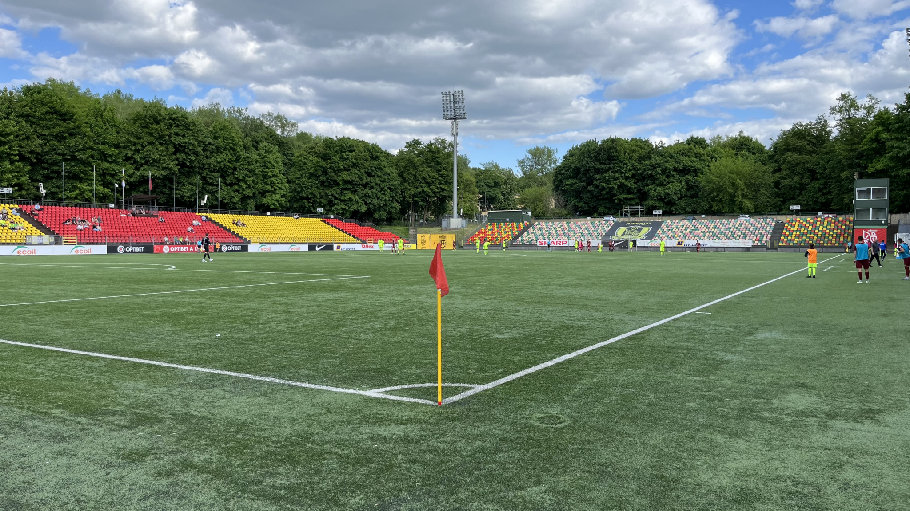

⚽️ FK Kauno Žalgiris – DFK Dainava 1:0  
🏆 A Lyga  
🏟 S.Dariaus-und-S.Girėno-Stadion  
🥁 ca. 400 Zuschauer  

Die Straßen von Kaunas sind gesäumt von Menschen in Trikots von FC Barcelona, Real Madrid, Olympiaskos Piräus & AS Monacco. Das liegt an dem an diesem Wochenende stattfindenden Final Four der Basketball Euro League. Eine große Ehre für das kleine, aber basketballverrückte Litauen. Am Vortag hat Madrid den Classico für sich entschieden, im zweiten Halbfinale hat sich Olympiakos für das Endspiel am Sonntag qualifiziert. Am heutigen Tag tingeln die Fans bei stundenlangem Sonnenschein einfach nur fröhlich durch die Altstadt.

An Fußball denken dabei nur die wenigsten. *We are shit* ist die zweimalige Antwort auf mein Vorhaben, mir am Wochenende zwei Spiele anzuschauen. Immerhin 400 Zuschauer sehen das anders (oder haben sich trotzdem in das Nationalstadion im Sportkomplex des Nordens der Stadt verlaufen). Dabei ist ein Block von ca. 25 Personen auf der Gast- und 15 Fans auf der Heimseite, die ein wenig für Bambule sorgen. Das Niveau ist überraschend gut. Beide Teams hätten in der Tagesform durchaus die Möglichkeit gehabt auf mittlerem deutschen Zweitliganiveau mitzukicken. Das Tor des Tages fällt nach einer schnellen Kombination über drei Stationen durch Xabi Auzmendi, der den Ball in die linke Ecke schlenzt. Um die 60. Minute gibt es nochmal eine Drangphase der Gäste mit drei sehenswerten Weitschüssen, die der Heimkeeper aber alle pariert. 

⚽️ FK Riteriai – FC Džiugas 1:1  
🏆 A Lyga  
🏟 LFF Stadionas  
🥁 135 Zuschauer  

Vilnius zeigt sich am Sonntag von seiner besten Seite. Wegen des Sonnenscheins sind wahnsinnig viele Menschen auf der Straße. Kirchen, Cafés, Restaurants, alles ist gut gefüllt. Noch mehr ist draußen auf der Straße los. Ein paar vereinzelte Basketbaltrikots und viele Rammstein Shirts, die hier am Montag ein Open Air Konzert spielen werden. Bei einer Kundgebung auf dem Platz nahe der Katedrahle St. Stanislaus werden der über 1.400 eingesperrten Oppositionellen in Belarus gedacht: Die Grenze ist nur 30 km entfernt.

Craft Beer, Sonne, Groundhopping. Besser kann es nicht kommen. Wenngleich die Partie auf dem Papier wenig hergibt: Hier spielt der Letzte gegen den Vorletzen. Handgezählte 135 Zuschauer sind dabei. Dabei begegnet mir viel Deutsch, mit Sicherheit 20 Personen sind hier um den Stadionpunkt einzusammeln. Auf Seiten der Heimfans gibt es nur einen Block aus 5 Personen. Die Auswärtsmannschaft wird von einem Fan lautstark unterstützt, der auf einer Distanz von 30 Metern immer hin und her rennt. Sogar zwei Zaunfahnen hat er angebracht.

Nach der Halbzeit flüchte ich mich auf die Schattenseite und lerne ihn kennen. Romas erklärt mir, dass die drei Autostunden entfernte Stadt Telšiai seine Geburtsstadt ist und er mit ihnen im Abstiegskampf leidet. Meine Sympathie liegt damit natürlich direkt bei den Gästen. In der 83. Minute allerdings geht dann die Heimmannschaft nach einem Kopfballtor in Führung. Zur Freude des Heimblocks, der durch ein paar Groundhopper auf mittlerweile 15 Leute angewachsen ist. Die haben den Schlachtruf Riteriai! schnell erlernt. Die gute Stimmung wird auch durch die Kombination aus Bier und praller Sonne angetrieben.

In der 88. Minute klingellt es dann auf der anderern Seite. Romas‘ Euphorie weilt aber nur wenige Sekunden: Abseits. Nach kurzem Bepöbeln des Schiris stellt er direkt wieder auf Motivation um und erklärt mir, dass es noch einen 11er für sein Team geben wird. *I promise, it’s on my mind. It’s psychology.*

Sechs Minuten werden nachgespielt. Nach 90+5 drängt das Team des FC Džiugas zum letzten Mal in den Strafraum. Handspiel. Elfmeter für den Gast. Kein Skript, ist wirklich so passiert. *I told you.*

Der Stürmer verwandelt. Abpfiff. Punktgewinn für die Mannschaft von einem der coolsten Fußballfans, denen ich bisher begegnet bin. 