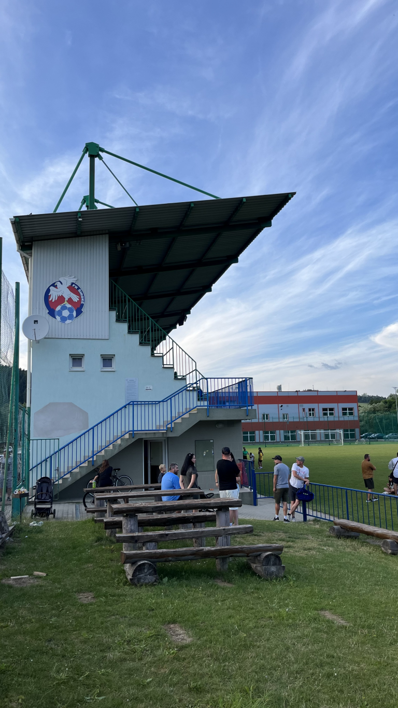
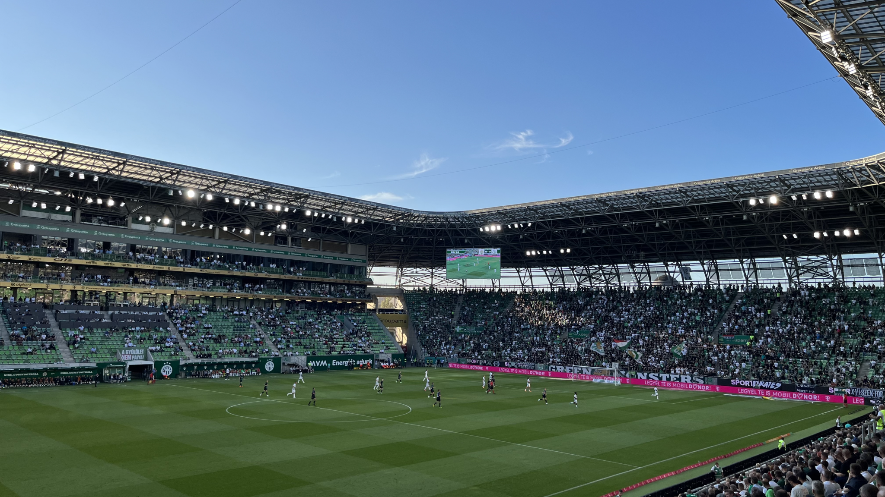
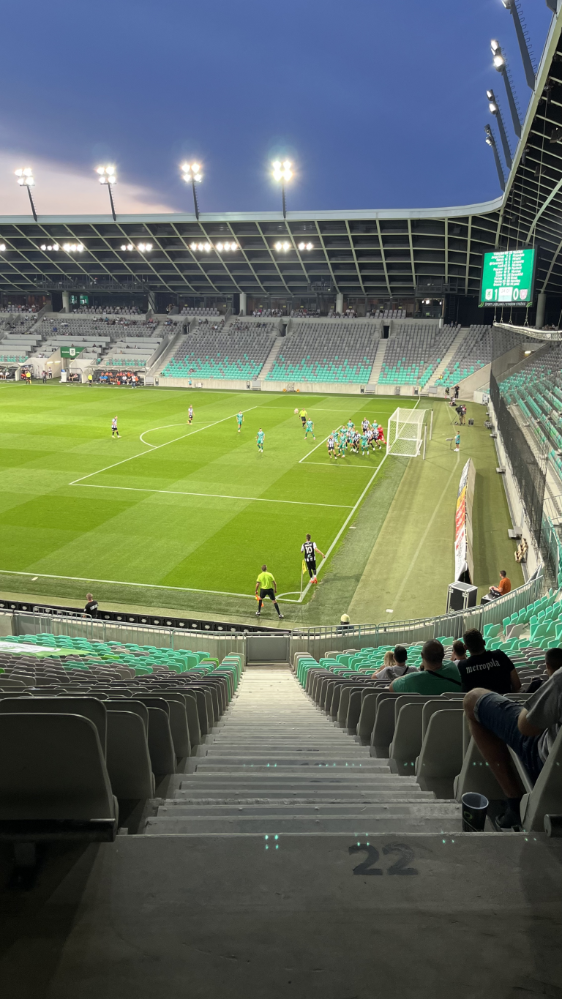
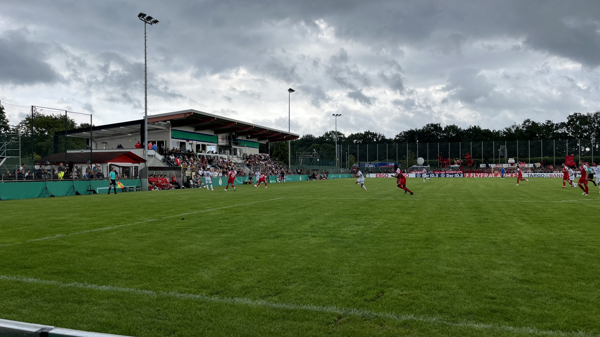

Transfer Offensive aus Saudi Arabien. Dreistellige Millionentransfers und Hick-Hack selbst in der Farmers League Bundesliga. Eine neue Spielzeit, zu der sich die Konzernklubs hierzulande sehr gut aufgestellt haben. Gründe sich seiner Zeit etwas anderem zu widmen gibt es genug. Und trotzdem rollt die Kugel ja auch an den vielen schönen Orten ganz abseits von all dem Wahnsinn. Auf in 23/24! 🙂 

⚽️ FK Široké – OTM Jamnik 7:8 n.E. (2:2)  
🏆 Slowakischer Fußballpokal  
🏟 Futbalový štadión Široké  
🥁 ca. 250 Zuschauer  

Der slowakische Fußballpokal bietet in der Theorie über 200 teilnehmenden Mannschaften die Chance auf den Titel. In der ersten Runde spielen jeweils Dritt- und Zweitligisten gegeneinander, was in dem mehrgleisigen System im 5-Millionen-Einwohner Land auf Amateurfußball hinausläuft.

So duellieren sich am heutigen Tag auch die Teams von FK Široké und OTM Jamnik. Das Zweitausend Seelen Dörfchen der Heimmannschaft verfügt über eine sehr schöne Kirche und kann mit einem Blick auf das ca. 50km entfernte Hochgebirge der Hohen Tatra punkten. Immerhin 500 Zuschauer würden auch Platz auf der Tribüne des Fußballplatzes finden, die circa zur Hälfte gefüllt ist.

Das Niveau ist entsprechend den Grundvoraussetzungen. Spielerisches Highlight ist ein direkt verwandelter Freistoß der Gäste in der 90. Spielminute, welche sie ins direkt anschließende Elfmeterschießen rettet. Nach kurzer Rangelei fallen auf beiden Seiten je ein Spieler durch Platzverweis aus, ehe sich die Gäste mit 6-5 durchsetze

⚽️ Ferencváros Budapest – Shamrock Rovers 4:0  
🏆 Conference League Qualifikation  
🏟 Groupama Aréna  
🥁 10.735 Zuschauer  

Für den Eintritt zu einem Spiel von Ferencváros muss ähnlich wie bei einigen Klubs in den Niederlanden eine Fan ID mit allem Drum & Dran angelegt werden. Der feuchte Traum aller Befürworter von personalisierten Tickets stellt allerdings nicht nur für Tagesgäste einen ziemlichen Irrsinn da.

Das Spiel gegen die von 60 Auswärtsfands begleiteten Gäste aus Irland ist sehr eindeutig. Nur zu Beginn ist es ein Box-to-Box Austausch. Nach dem ersten Tor geht es dann nur in eine Richtung. Es fallen drei weitere Tore. Eine kurze Dranphase der Gäste zum Ende der Partie wird immerhin mit einem Lattentreffer belohnt. 

⚽️ NK Olimpija Ljubljana -NK Rogaška 5:0  
🏆 Slovenska Nogometna Liga  
🏟 Stadion Stožice  
🥁 ca. 500 Zuschauer  

Olimpija hat in der vergangenen Saison den Rekordmeister aus Maribor entthront und sich den ersten Titel seit 2018 erspielt. In die neue Saison starten sie mit einer leichten Aufgabe. Die Gäste aus Domžale haben der Offensive nur wenig entgegenzusetzen. Viel Zuschauerzuspruch gibt es für den grauen Ligaalltag scheinbar nicht. Nur etwa 500 Zuschauer haben sich am Samstag Abend eingefunden. Das Stadion wacht ab der 70. Minute nochmal auf, nachdem die Energie vom ca. 100 Personen fassenden Stehblock auf die gesamte Tribüne übergeht. Belohnt wird das mit drei Toren in den letzten zehn Minuten.

Etwas mehr Spannung verspricht die Champions League Qualifikation, in der sich Olimpija zwei Tage später in der Nachspielzeit gegen Ludogorez Rasgrad aus Bulgarien durchsetzt. In der dritten Qualirunde scheitern sie dann allerdings an Galatasaray Istanbul. 

⚽️ FC Oberneuland – FC Nürnberg 1:9  
🏆 DFB Pokal, 1. Runde  
🏟 Marko-Mock-Arena  
🥁 2.187 Zuschauer  

Die Spielstätte des FC Oberneuland liegt zwischen Autobahn und Parkanlage am Rande von Bremen. Wahrscheinlich auch wegen der Lage ist der Verein nur Nummer Drei hinter Werder und dem Bremer SV, dessen Stadion mitten in der Stadt liegt. Der Platz ist fest in Rot-Weißer Hand der mitgereisten Franken.

Nach einer halben Stunde steht es bereits 0:6. Zweistellig wird es aber nicht, da der Zweitligist aus Nürnberg im Anschluss den Fuß vom Pedal nimmt und nur noch drei weitere Tore erzielt. Zehn Tore gibt es in Summe aber dennoch zu sehen, da Bakary Lambers den umjubelten Ehrentreffer zum zwischenzeitlichen 1:8 erzielt.

Die Stimmung wird gedrückt durch die Kunde des Erstrunden Aus von Werder bei Viktoria Köln zur gleichen Zeit. 