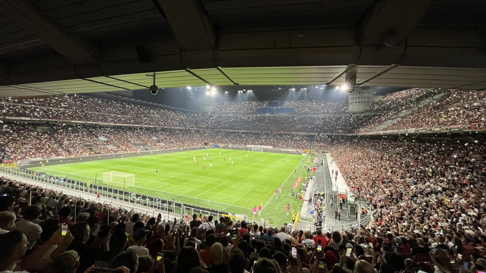

*La Scala del Calcio*, das Opernhaus des Fußballs. Das Giuseppe-Meazza Stadion gehört zu den faszinierensten Orten im europäischen Fußball. Die Liste der Geschichten und Bilder ist endlos lang, seitdem hier vor 97 Jahren (!) das erste Spiel stattgefunden hat. Jede Woche ein Spiel, der AC Milan & Internationale im Wechsel. Zwei Weltmeisterschaften, eine Europameisterschaft. Europapokalendspiele. Das Derby della Madonnina, Marco Materazzi und Rui Costa im Bengalonebel. Nur ein paar Punkte auf einer ewig langen Liste von Gründen, warum das San Siro einen so großen Sehnsuchtsort darstellt.

Die vergangenen drei Jahre sind geprägt durch die Mailänder Fußballrenaissance. Neun lange Jahre in Serie stand Juventus Turin an der Spitze der Serie A. 2021 brach Inter Mailand diese Serie. Ein Jahr später hat der AC Milan den Stadtrivalen wieder abgelöst. Beide stehen jetzt bei 19 Meisterschaften.
  
Und während sich der SSC Neapel in der vergangenen Spielzeit den vielumjubelten Scudetto sicherte, trafen die beiden Mailänder Klubs im Champions League Halbfinale aufeinander. Die Nerazzurri stachen Milan ins Herz. Mailänder Fußball findet endlich wieder auf allerhöchstem Niveau statt.

⚽️ AC Milan – FC Turin (4:1)  
🏆 Serie A  
🏟 Giuseppe-Meazza Stadion  
🥁 72.013 Zuschauer  

Die Vorfreude auf die neue Spielzeit ist groß. Zum ersten Mal richtig laut wird es bei der Hymne kurz vor Anpfiff.

*Che confusione*  
*Sarà perché ti amo*  
*È un’emozione*  
*Che cresce piano piano*  
*Stringimi forte e stammi più vicino*  

*Was für ein Chaos. Es muss sein, weil ich dich liebe.*  
*Es ist ein Gefühl das langsam wächst*  
*Halt mich fest und bleib bei mir.*  

Viel Italien in wenigen Zeilen.

Der AC bringt die Euphorie und seine Überlegenheit auch von Beginn an auf den Platz. Nach einer halben Stunde darf sich die Energie dann zum ersten Mal entladen. Neuzugang Christian Pulisic trifft nach ansehnlicher Kombination zur Führung.

Ein kurzes Schweigen verursachen die Gäste mit dem zwischenzeitlichen Ausgleichstreffer nur drei Minuten später. Nach einem Doppelschlag aus Elfmeter von Olivier Giroud & Schlenzer von Theo Hernandez geht es mit einem komfortablen Vorsprung in die Kabinen.

Mit etwas weniger Tempo gelingt in der zweiten Hälfte noch ein weiterer Treffer per Strafstoß. Die Gäste aus Turin kommen nicht mehr gefährlich vor das Tor. Drei Punkte für den AC Milan zum Start in eine Spielzeit in der Serie A, die zur Zeit zu vielen anderen europäischen Ligen einen entscheidenden Unterschied aufweisen kann: An der Spitze ist alles offen. Mailand ist zweimal mit in der Verlosung.
